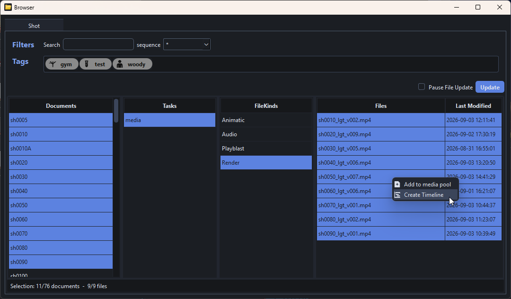
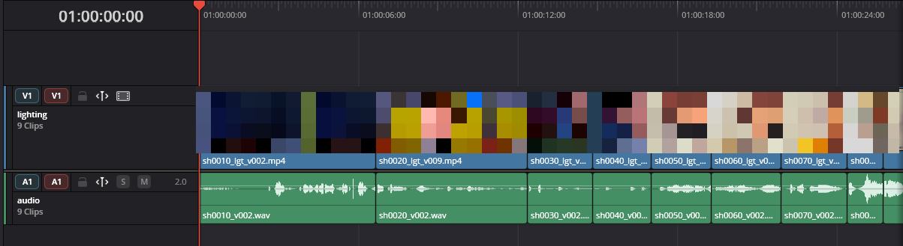

# DaVinci Resolve Launcher

## What is DaVinci Resolve Launcher?

DaVinci Resolve has a few quirks that make it hard to integrate into a python pipeline, especially in its Free Edition.
DaVinci Resolve Launcher is a solution that facilitates project configuration, scripts, configuration and python usage. It also provides a way to easily share a Resolve configuration across a team.

## Features

- Configuration of a python environment
- Configuration of interactive scripts
- Configuration of project databases
- Open project on startup
- Exectute python script on startup
- Custom Resolve shortcuts driven by configuration files

## Example

While we do not provide any specific tool, with DaVinci Resolve Launcher, being able to configure a python environment means the sky is the limit.

Here is an example of tool that DaVinci Resolve Launcher unlocks:

This tool uses:

- PySide6 (for the graphical interface)
- pymongo (for database queries)
- lucent (for file discovery)
- opentimelineio (for generating a timeline)

In addition to Resolve's python api, this allows to generate full timelines in a matter of seconds.

---

!!! info ""
    <a href="Next Section"> 
 [Next Section : Quick Start](./quickstart.md) 
